# 🌙 MuslimPath

> _Your Ramadhan Companion. Beautifully Crafted._

[](https://kotlinlang.org)
[](https://www.jetbrains.com/lp/compose-multiplatform/)
[](https://github.com/anomalyco/ramadhan)
[](https://creativecommons.org/licenses/by-nc-nd/4.0/)

A beautifully crafted Ramadhan companion app built with **Kotlin Multiplatform** & **Compose Multiplatform**.
Read the Quran, track prayer times, find the Qibla, and organize your bookmarks — all in one place.

<p align="center">
  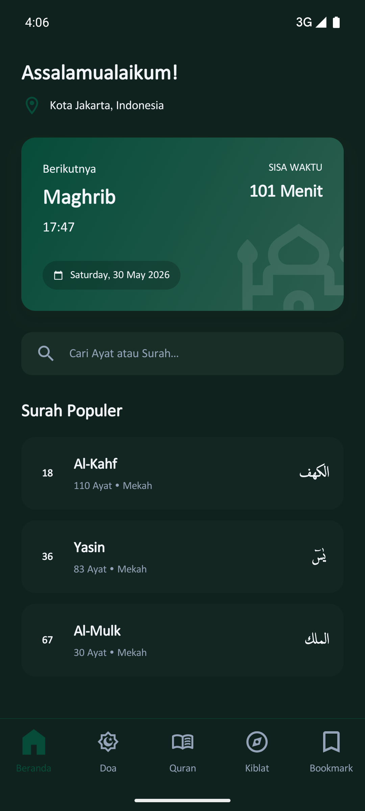
</p>

---

## ✨ Screenshots

<table>
  <tr>
    <td align="center"><b>Beranda (Home)</b></td>
    <td align="center"><b>Doa (Prayer Schedule)</b></td>
  </tr>
  <tr>
    <td></td>
    <td>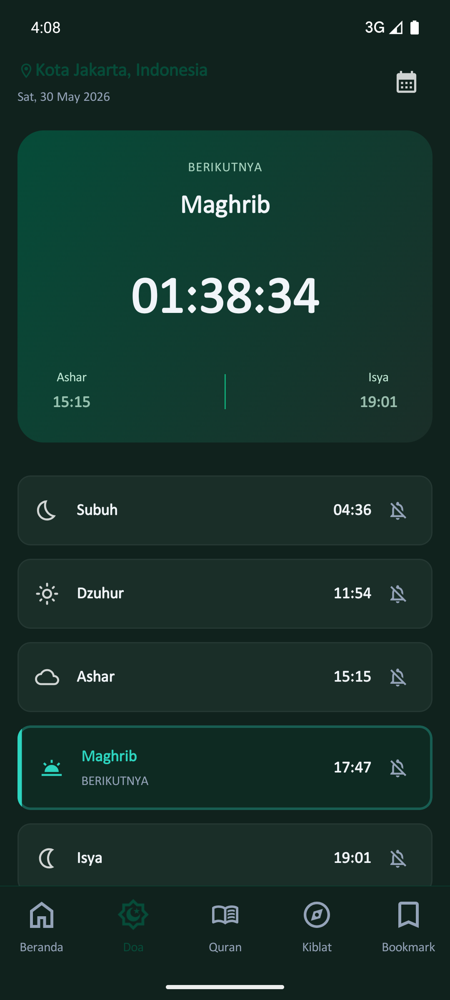</td>
  </tr>
  <tr>
    <td align="center"><b>Quran Surah List</b></td>
    <td align="center"><b>Qibla Compass</b></td>
  </tr>
  <tr>
    <td>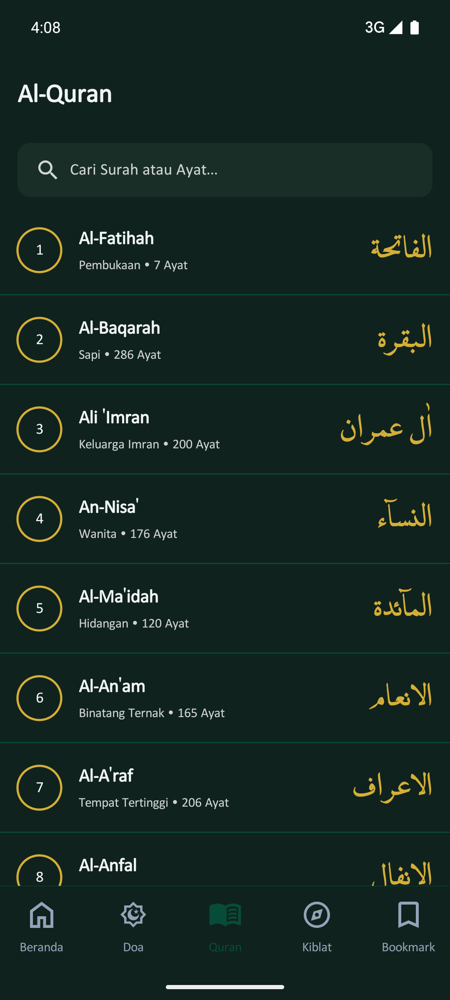</td>
    <td>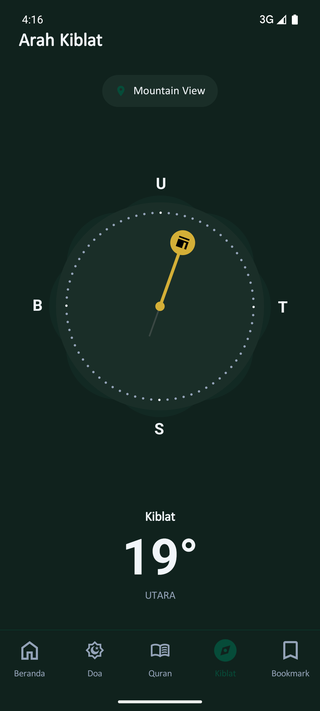</td>
  </tr>
</table>

---

## 📱 Features

### 🏠 Home

<p align="center">
  
</p>

The Home tab greets you with **"Assalamualaikum!"** alongside your current city and date.
A prominent prayer countdown card shows the next prayer with remaining time and a mosque illustration.
Quick-access **"Surah Populer"** carousel highlights Al-Kahf, Yasin, and Al-Mulk.
**"Terakhir Dibaca"** picks up right where you left off.
A search box lets you find any ayat or surah instantly: **"Cari Ayat atau Surah..."**.

<p align="center">
  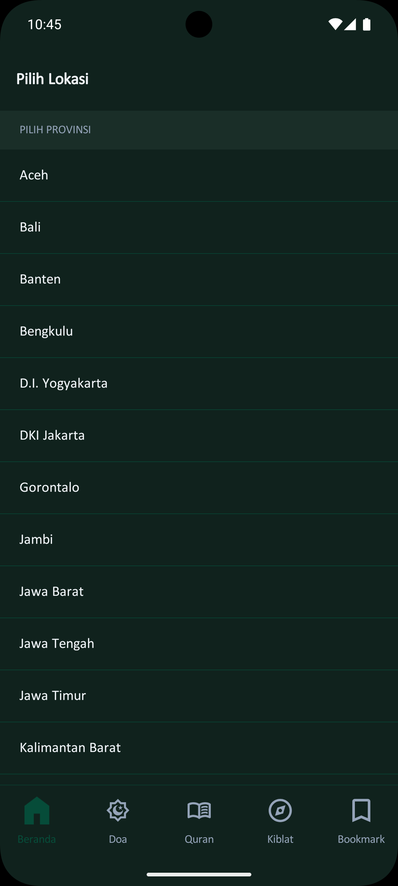
</p>

The **location picker** uses a province → city hierarchy covering all of Indonesia, so prayer times and Qibla bearings are always accurate.

---

### 🕌 Prayer Schedule

<p align="center">
  
</p>

The Prayer tab displays a live countdown timer to the next prayer (e.g., _01:38:32_), flanked by the previous and upcoming prayer times.
All five daily prayers — **Subuh, Dzuhur, Ashar, Maghrib, Isya** — are listed with their scheduled times and per-prayer alarm toggles.
A date picker lets you check past or future schedules at a glance.

<details>
<summary>🎬 Watch Adzan Notification Demo</summary>

[pray_time_notif.webm](https://github.com/user-attachments/assets/8e01267b-9008-4b00-b302-9bf759166f63)

</details>

---

### 📖 Quran

<table>
  <tr>
    <td align="center"><b>Surah List</b></td>
    <td align="center"><b>Surah Detail</b></td>
  </tr>
  <tr>
    <td></td>
    <td>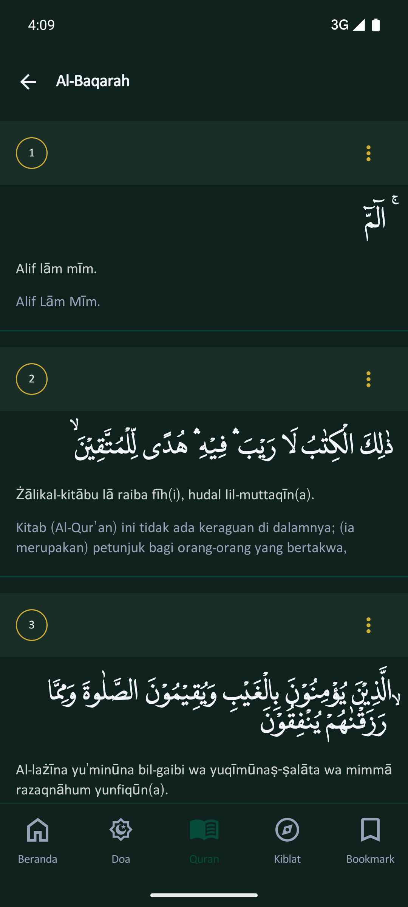</td>
  </tr>
</table>

Browse all **114 surahs** with gold-outlined number badges, Latin names, Indonesian translations, and ayat counts.
Tap a surah to reveal per-ayat cards featuring **Arabic text in the LPMQ IsepMisbah font**, Latin transliteration, and Indonesian translation.

<table>
  <tr>
    <td align="center"><b>Ayat Actions</b></td>
    <td align="center"><b>Bookmark Picker</b></td>
  </tr>
  <tr>
    <td>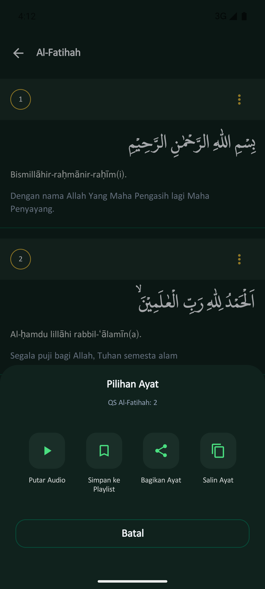</td>
    <td>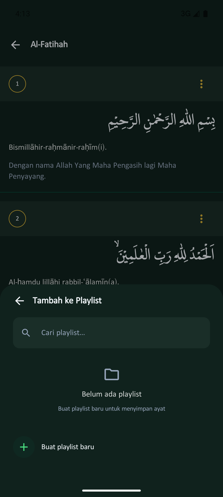</td>
  </tr>
</table>

The **ayat bottom sheet** (_Pilihan Ayat_) gives you instant access to:
- ▶️ **Play Audio** stream recitation with a full playback bar
- 🔖 **Bookmark** save to a playlist/category
- 🔗 **Share** share the ayat text
- 📋 **Copy** copy to clipboard

Saved ayats show a **"Tersimpan di bookmark"** badge.

<details>
<summary>🎬 Watch Ayat Share Demo</summary>

https://github.com/user-attachments/assets/1e6df25b-4dc1-4b5c-9ac1-c70238f3f325

</details>

<table>
  <tr>
    <td align="center"><b>Audio Player</b></td>
    <td align="center"><b>Now Playing</b></td>
  </tr>
  <tr>
    <td>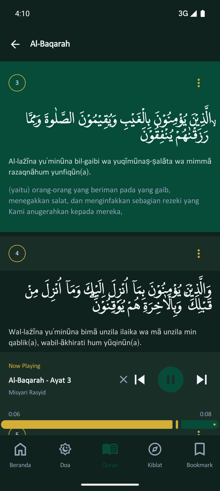</td>
    <td>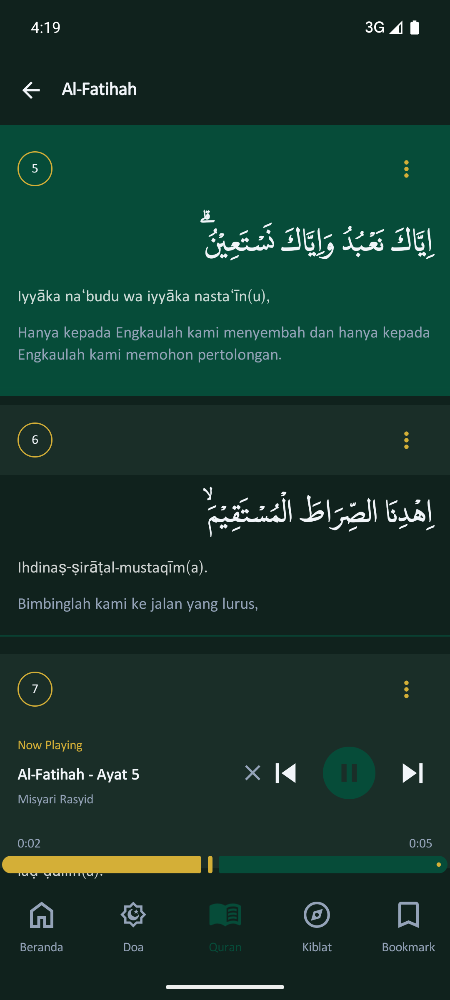</td>
  </tr>
</table>

The floating audio player bar shows the **Now Playing** surah and ayat, reciter name (e.g., _Misyari Rasyid_), a progress bar, and prev/next/close controls.

<details>
<summary>🎬 Watch Audio Playback Demo</summary>

[quran_audio_playback.webm](https://github.com/user-attachments/assets/0e72aa78-bb02-4e64-b1e7-d6ea1043b45d)

</details>

---

### 🧭 Qibla Compass

<p align="center">
  
</p>

The Qibla tab features a **custom-drawn compass dial** with cardinal letters (U/T/S/B for Indonesian Utara/Timur/Selatan/Barat), decorative petals, 5° tick marks, and a gold Kaaba pointer.
Your current city is displayed as a chip, along with the precise bearing degree (e.g., _19°_) and cardinal direction text.

<details>
<summary>🎬 Watch Compass Rotation Demo</summary>

https://github.com/user-attachments/assets/bbe471a0-b8b0-40bb-a451-d903eaf8e2e8

</details>

---

### 🔖 Bookmarks

<table>
  <tr>
    <td align="center"><b>Saved Ayats</b></td>
    <td align="center"><b>Create Category (empty)</b></td>
    </tr>
  <tr>
    <td>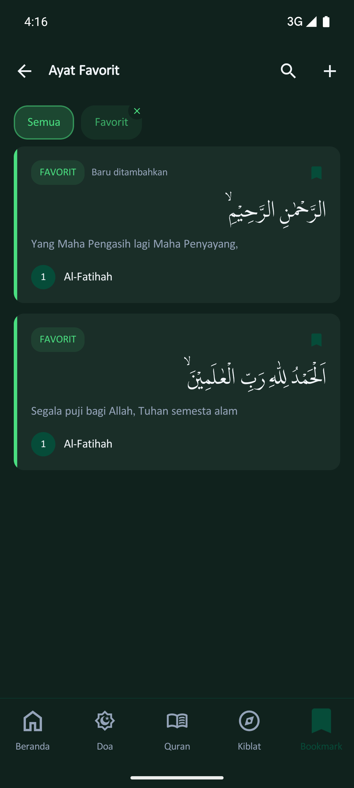</td>
    <td>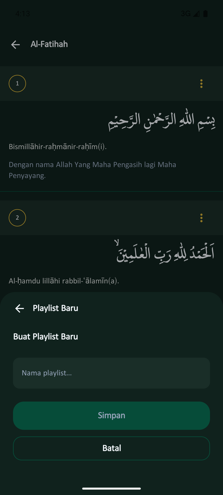</td>
  </tr>
  <tr>
    <td align="center" colspan="2"><b>Create Category (filled)</b></td>
  </tr>
  <tr>
    <td align="center" colspan="2">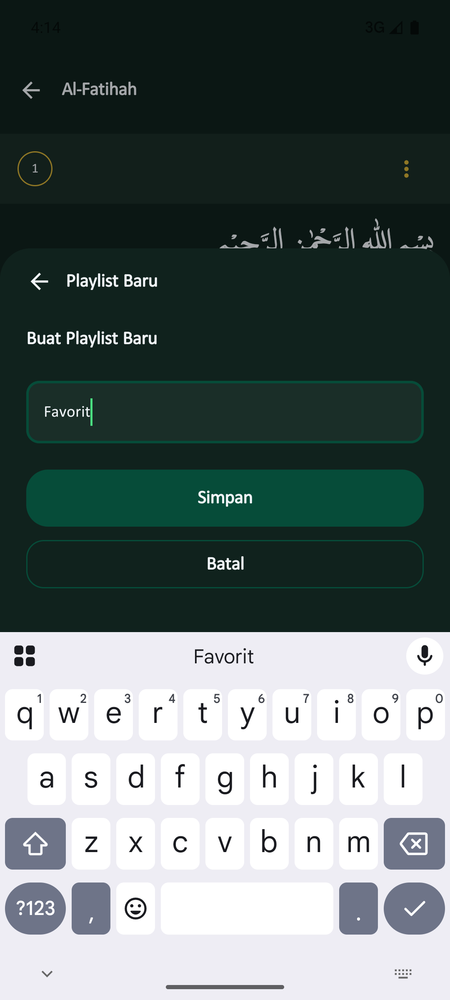</td>
  </tr>
</table>

The **"Ayat Favorit"** tab organizes your saved ayats with:
- **Category chips** — "Semua" + custom playlists (e.g., "Favorit") with color-coded labels
- **Bookmark cards** — showing Arabic text, translation, surah name + number, category badge, and save timestamp
- **Full-text search** — FTS-powered instant search across all bookmarks
- **Create new playlist** — bottom sheet with name input and color palette
- **Delete** — remove individual bookmarks or entire categories

<details>
<summary>🎬 Watch Bookmark Navigation & Copy Demo</summary>

https://github.com/user-attachments/assets/1998c88c-72e4-4d15-8a86-91cf93101a8a

</details>

---

### 📲 Deep Links

MuslimPath supports deep linking for direct Quran navigation:

```
ramadhancamp://quran/{surahId}           → Open surah
ramadhancamp://quran/{surahId}/{ayatNumber} → Open specific ayat
```

---

## 🎨 Design System

### Colors

| Swatch | Hex | Usage |
|:------:|:---:|:------|
| 🟫 | `#10221D` | **bgPrimary** main background |
| 🟫 | `#1A2E28` | **bgSecondary** card background |
| 🟩 | `#064C39` | **bgSurface** elevated surfaces |
| 🟢 | `#4ADE80` | **accentPrimary** highlights, active states |
| 🟡 | `#D4AF37` | **accentGold** surah badges, Kaaba pointer |
| ⬜ | `100% white` | **textPrimary** main text |
| ⬜ | `80% white` | **textSecondary** secondary text |
| ⬜ | `40% white` | **textMuted** muted/hint text |
| ⬛ | `dark text` | **textOnLight** text on accent backgrounds |
| ⬜ | `10% white` | **divider** separator lines |

### Typography

All text — including Quran ayat — uses **LPMQ IsepMisbah**, ensuring consistent and beautiful Arabic rendering.

| Token | Size | Weight |
|:------|:----:|:------:|
| `headlineLarge` | 24sp | Bold |
| `headlineSmall` | 17sp | SemiBold |
| `bodyLarge` | 15sp | Normal |
| `labelLarge` | 14sp | Medium |
| `labelSmall` | 12sp | Medium |

---

## 🛠 Tech Stack

I've used a carefully chosen set of modern libraries and tools to deliver a robust cross platform experience.

| Library | Version | Purpose |
|:---|:---:|:---|
| Kotlin | 2.3.0 | Programming language |
| Compose Multiplatform | 1.10.0 | Shared user interface framework |
| Navigation3 | 1.0.0 alpha05 | Handling screen transitions and deep links |
| Ktor | 3.4.0 | Network client for reliable API communication |
| Koin | 4.1.1 | Dependency injection |
| Coil | 3.4.0 | Fast image loading |
| Kotlinx Serialization | 1.10.0 | Parsing JSON data |
| Kotlinx Coroutines | 1.10.2 | Managing background tasks asynchronously |
| Kotlinx Datetime | 0.7.1 | Working with dates and times across platforms |
| Room | 2.8.4 | Storing structured data locally |
| SQLite Bundled | 2.6.2 | Core database engine |
| SQLDelight | 2.2.1 | Type safe SQL operations |
| Multiplatform Settings| 1.3.0 | Saving simple key value preferences |
| Compass | 3.0.1 | Geocoding and geolocation for accurate prayer times |
| Alarmee | 2.6.0 | Scheduling local notifications and alarms |
| MOKO Permissions | 0.20.1 | Requesting device permissions seamlessly |
| CMP Media Player | 1.0.53 | Playing audio streams |
| Napier | 2.7.1 | Unified logging for easier debugging |
| Inspektify Ktor 3 | 1.0.0 beta10 | Inspecting network traffic |
| BuildKonfig | 0.17.1 | Passing build time configurations |
| Kotlin Parcelize | 2.3.10 | Easy object serialization on Android |
| ConstraintLayout | 0.6.1 | Complex UI layouts in Compose |
| AGP | 9.0.1 | Android Gradle build system |
| Android minSdk and compileSdk | 27 and 36 | Android platform targets |
| iOS deployment target | 18.2 | Minimum iOS requirement |

**API**: [eQuran.id](https://equran.id/) for Quran text, surah metadata, and prayer schedules.

---

## 🏗 Architecture

MuslimPath follows **Clean Architecture** with an **MVI** presentation pattern.

```
┌─────────────────────────────────────────────────┐
│                  Presentation                    │
│  Screen → ViewModel → Content (3-tier pattern)  │
│  State / Event / Effect model per feature        │
└────────────────────┬────────────────────────────┘
                     │
┌────────────────────▼────────────────────────────┐
│                   Domain                        │
│  Models · Repository Interfaces · Use Cases     │
└────────────────────┬────────────────────────────┘
                     │
┌────────────────────▼────────────────────────────┐
│                    Data                         │
│  Repository Impls · DTOs · Mappers · Datasources │
└─────────────────────────────────────────────────┘
```

Each feature (`home`, `pray`, `quran`, `qibla`, `bookmark`, `about`) is organized as:

```
feature/{name}/
├── presentation/
│   ├── model/          # State, Event, Effect
│   ├── components/     # Feature-specific composables
│   └── {Name}Screen.kt # 3-tier: Screen → ViewModel → Content
├── domain/
│   ├── model/          # Pure data classes
│   ├── repository/     # Repository interfaces
│   └── usecase/        # Business logic
├── data/
│   ├── model/          # DTOs
│   ├── mapper/         # DTO → Domain mappers
│   ├── datasource/     # Remote datasource & Preferences
│   └── repositories/   # Repository implementations
└── di/
    └── {Name}Module.kt # Koin module
```

---

## 🚀 Getting Started

### Prerequisites

- Android Studio Hedgehog or newer
- Xcode 16+ (for iOS)
- JDK 17+

### Android

```bash
# Clone the repository
git clone https://github.com/anomalyco/ramadhan.git
cd ramadhan

# Build debug APK
./gradlew :composeApp:assembleDebug

# Install on connected device
./gradlew :composeApp:installDebug
```

### iOS

1. Open `iosApp/iosApp.xcodeproj` in Xcode
2. Select a simulator or connected device
3. Press ▶️ Run

---

## 📂 Project Structure

```
ramadhan/
├── composeApp/
│   └── src/
│       ├── commonMain/kotlin/com/iqbalwork/ramadhancamp/
│       │   ├── App.kt                        # Root: Theme + Nav setup
│       │   ├── feature/
│       │   │   ├── home/
│       │   │   ├── pray/
│       │   │   ├── quran/
│       │   │   ├── qibla/
│       │   │   ├── bookmark/
│       │   │   └── about/
│       │   └── shared/
│       │       ├── common/
│       │       │   ├── navigation/            # AppDestination, NavController
│       │       │   ├── network/              # Ktor HttpClient, safeApiCall
│       │       │   ├── preferences/          # AppPreferences, ScopedPreferences
│       │       │   ├── ui/                   # BaseViewModel, Theme, components
│       │       │   ├── geo/                   # Compass & location (expect/actual)
│       │       │   └── utils/                # AppError, platform helpers
│       │       └── di/
│       │           └── initKoin.kt            # Koin module registry
│       ├── androidMain/kotlin/...             # Android-specific implementations
│       └── nativeMain/kotlin/...             # iOS/Native-specific implementations
├── iosApp/                                    # iOS app entry point
├── docs/
│   └── assets/
│       ├── screenshots/
│       └── videos/
├── gradle/
│   └── libs.versions.toml                     # Version catalog
└── build.gradle.kts
```

---

## 🙏 Acknowledgments

- **[eQuran.id](https://equran.id/)** Free Quran API providing surah data, ayat translations, and prayer schedules
- **LPMQ IsepMisbah** Beautiful Arabic font for Quran text rendering
- **[Kotlin Multiplatform](https://kotlinlang.org/docs/multiplatform.html)** Shared logic across platforms
- **[Compose Multiplatform](https://www.jetbrains.com/lp/compose-multiplatform/)** Shared UI across platforms

---

## 📄 License

This project is licensed under **Creative Commons Attribution-NonCommercial-NoDerivatives 4.0 International (CC BY-NC-ND 4.0)**.

© 2026 Alexius Andrianno Alfa Renanta. All rights reserved.

[](https://creativecommons.org/licenses/by-nc-nd/4.0/)
